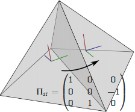
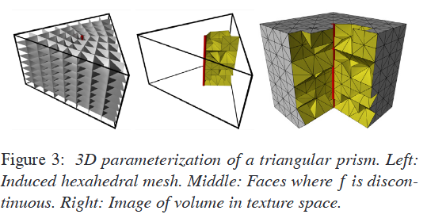
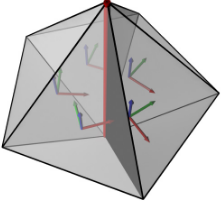

# CubeCover– Parameterization of 3D Volumes
# 简介
CubeCover使用标架场引导具有边界对齐的Cubes，然后生成六面体。
1. 构建了一套考虑奇异结构的体参数化理论
2. 提出了一个框架用于规划引导体参数化的标架场
3. 使用规划的标架场，提出了一个自动化算法计算参数化

## 结论
提出了CUBECOVER算法来计算给定体积的3D六面体网格。六面体与引导的框架场以及体积边界对齐。还推导出了关于奇点和梯度框架场的几个理论条件。最后，提出了一种使用手动生成的元网格设计框架场的方法。

## 不足
奇点位置不好可能导致扭曲。如果扭曲过大，参数化中可能出现翻转的四面体。目前可以通过后处理来处理这种情况，或者尝试通过预处理框架场（例如平滑）来避免。

# 主要流程
- 规划一个用于引导的标架场
  - 在体积内没一点处包含三个向量，形成一个局部坐标标架
- 生成对齐于该场的参数化
  - 基于该标架场，在 $L^2$ 尺度下优化得到一个相关的参数化
  - 涉及到3d的参数化和奇异结构都很复杂
- 根据参数化，生成六面体网格
  - 从参数化结果中提取所有等值面，便可以得到六面体网格的各个面

# 基本概念
## 奇异结构
- 以曲面的四边形网格参数化为例，一个奇异结构指的是不规则顶点（irregular vertex），即该顶点的度/价（valance）不是`4`。
- 在纯六面体网格中，不存在不规则face或者孤立的不规则vertex，不规则性通常产生在edge上:
  - 不规则的内部edge：指与该edge接触的六面体数量，不等于`4`

## 参数化

给定一个体积 $V\sub \mathbb{R}^3$ ,其边界为一个2维封闭曲面 $M=\partial V$ 。一个 $V$ 的体参数化（volume parameterization）指的是一组映射：

$$
f\rightarrow\mathbb{R}^3 ,p\rightarrow (u,v,w)^T
$$ 

一个不退化的参数化 $f$ 指的是通过 $f^{-1}(C)$ 诱导出的六面体细分， $C$ 是 $\mathbb{R}^2$ 中规整的立方体（cube）细分：

$$
C:=\{(x,y,z)\in\mathbb{R}^3|x\in\mathbb{Z}\lor y\in\mathbb{Z}\lor x\in\mathbb{Z}\}
$$

### 过渡函数
在给定一个初始四面体网格后， $f$ 首先被离散化，并在每个tet（也被称作`chart`）中有不同的值。从而，在每对相邻的四面体单元 $s$ 和 $t$ 之间，需要一个过渡函数（transition function）关联起来。从而导出的六面体网格不会存在明显的缝隙（seam）。这篇文章，过渡函数 $f_{|t}$ 指的是那些保持标准立方网格 $C$ 不变的正向线性函数：

$$
\begin{equation}
f_{|t}=\Pi_{st} f_{|s} + g_{st}
\end{equation}
$$

-  $g_{st}$ （叫做 $s$ 和 $t$ 中的`gap`），是 $\mathbb{Z}^3$ 中的常数向量。。表示对 cube grid 的整数平移（integer translation）。
-  $\Pi_{st}$ （叫做 $s$ 和 $t$ 之间的`matching matrix`），是手性立方体对称群（chiral cubical symmetry group）中的元素，即将坐标轴映射到 $SO(3)$ 中的任意一个映射。这个群有`24`种变换。。

## 标架场和奇异结构
在每个tet $t$ 内定义了一个标架场`frame-field`，构建了一个局部坐标系统。其由3个三维向量组成：

$$
(U_t,V_t,W_t)
$$

每个参数化 $f(u,v,w)^t$ 定义了一个`frame-field`，通过计算其每个分量的梯度得到：

$$
(\nabla u,\nabla v, \nabla w)
$$

$\Pi_{st}$ 描述了标架场之间是如何组合连接的。在tet $t$ 中，其标架 $(U_t,V_t,Z_t)$ 与 tet $s$ 中的标架 $(U_s,V_s,Z_s)$ 在组合上是等同的，可以用一个矩阵乘法表示：

$$
\Pi_{st} \cdot (U_s,V_s,Z_s)
$$

参数化过程中需要注意的是`critical point`（梯度标架场的奇异结构）的处理。在普通的向量场中，这些点的雅可比矩阵是奇异的。现在通常用一个描述邻域内状态的**整数**`Index`来描述它。

在三维空间中，非退化标架场的奇异结构通常构成一条贯穿整个体积的一维曲线：

这种曲线，通常会在节点（node）汇聚，或者接触到表面边界。

### type
为了能够更好的描述这种3维标架场的奇异结构，这篇论文提出了`type`的观点。

给定一个四面体剖分的体积 $V$ ， $e$ 为其中任意一条有向边， $\gamma$ 是环绕 $e$ 的一个正向闭合曲线。从 $e$ 的某一个相邻tet $t_0$ 开始，$\gamma$ 会穿过 $e$ 向量的所有的tet $(t_0,\cdots,t_k,t_0)$ ，记这个串联为 与 $t_0$ 有关的 `type`：

$$
\begin{equation}
\text{type}(e,t_0):=
\Pi_{t_k t_0} \circ
\Pi_{t_{k-1} t_0} \circ
\cdots
\Pi_{t_1 t_2} \circ
\Pi_{t_0 t_1} 
\end{equation}
$$

`type` 定义了某个标架沿着 $\gamma$ 运动后回到起点时，经历了什么样的变换。如果`type`不是恒等映射（identity map）`Id`，那么这个edge是一个奇异边（如下图所示），否则是规整边：  

从而，tet $t_1$ 的`type`可以表示为tet $t_0$ `type`的基坐标变换：

$$
\text{type}(e,t_1)=
\Pi_{t_0 t_1} \circ
\text{type}(e,t_0) \circ
{\Pi_{t_0 t_1}}^{-1}
$$

#### 定理1  
设 $f$ 是一个参数化，其中所有四面体映射到另一个四面体时都是无退化的。则，每条边的`type`要么是`Id`，要么是围绕其中一个坐标轴的旋转。

给定一个非退化的参数化 $f$ ，将所有的tet的映射为另外一个tet。满足如下公式：

$$
\begin{equation}
\begin{align*}
f_{t_0}(p)&=\text{type}(e,t_0)\cdot f_{t_0}(p)+g \\
(\text{Id}-\text{type}(e,t_0))f_{t_0}(p)&=g
\end{align*} 
\end{equation}
$$

从而，所有edge`type`可以表示为10种中的1种：

$$
\{\text{Id},J_u^k,J_v^k,J_2^k|k\in\{1,2,3\}\}
$$

-  $J_u^k,J_v^k,J_2^k$ 分别是沿着对应坐标轴旋转90度的旋转矩阵。

#### 定理2
设 $p$ 是一个非退化六面体网格的`内部顶点`， $e_i$ 是其邻接边，那么满足：

$$
\begin{equation}
\sum_i(6-\text{valence}(e_i))=12
\end{equation}
$$

- 即所有的内部顶点的邻接边的度/价通过上式计算求和后恒等于12
- 注意必须是内部顶点。不然有些边界顶点（6个4价边+1个6价边）也满足上式。因为奇异点无法在内部结束。

## 算法流程

### 最小化能量
参数化目标是根据输入的标架场 $X$ ，优化出一个最佳对齐的参数线，它最小化的能量为：

$$
E(f)=\int_V||\nabla f-X||^2 \text{d}{vol}
$$

由于离散空间网格的分片线性，每个tet上每个顶点的值用于构造映射 $f$ ,每个tet上的每个顶点值的未知量存在一个向量中表示：

$$
\vec{f}=(u0,v_0,w_0,\cdots,u_N,v_N,w_N)^t \in \mathbb{R}^{12\cdot  \text{\#tets}}
$$

> 注意！每个顶点在不同的tet上，取值可能不一致

最后求解一个laplace方程：

$$
L\vec{f}=b
$$

- L是laplace矩阵
- b包含了框架场的离散散度

### 无缝约束
由于最有一个二次泛函的整数约束是一个NP hard问题，这篇论文使用了一个启发性的方法：在最开始的阶段，不使用整数约束，在每个相邻tet $(s,t)$ 和邻接面上的所有3条边 $(p,q)$ ，给定一个常数`gap`：

$$
f_{|t}(p)-f_{|t}(q)=\Pi_{st}f_{|s}(p)-f_{|s}(q)
$$

从而整个线性约束系统，加上边界条件，可以写作：

$$
Cu=0
$$

-  $C\in\mathbb{Z}^{\text{\# constraints} \times 12 \cdot \text{\# tets}}$ ，即C是一个约束个数*

这里使用拉格朗日乘数法优化：

$$
\left(
\begin{matrix}
    L &C^t \\
    C &0
\end{matrix}
\right)
\left(
\begin{matrix}
    \vec{f} \\
    \lambda 
\end{matrix}
\right)
=
\left(
\begin{matrix}
    b \\
    0 
\end{matrix}
\right)
$$

-  $\lambda \in \mathbb{R}^\text{\# constraints}$

## 构造标架场
输入四面体网格对结果有很大的影响。

### meta-mesh
1. 在输入四面体网格的每个四面体重心处，计算一个标架场。
2. 匹配矩阵 $\Pi_{st}$ 和其奇异结构都通过meta-mesh得到。假设相邻的tet $s,t$ 位于hex $c_s$ 或 $c_t$ 处，如果 $c_s=c_t$ 那么 $\Pi_{st}=\text{Id}$ 即是恒等变换。否则， $\Pi_{st}$ 被定义为从 $c_s$ 坐标基到 $c_t$ 的变换。
3. 最后，由标架场诱导边界条件：在每个边界tet上，与表面法线最对齐的的标架向量会被用于约束相关的坐标方程。

### 松弛
奇异结构通常沿着四面体网格的边产生，并不平滑，会有`zigzag`产生。为了使得最终的六面体网格奇异线平滑，使用了松弛操作：通过一个偏移向量迭代的改变所有的顶点的位置。
1. 每个六面体内对所有顶点定义了一个偏移向量，从而使每个六面体变形成一个完美立方（perfect cube）。
2. 对每个顶点的位移向量进行平均
3. 在迭代的每一步中，边界顶点会重新映射回其表面的原位置

