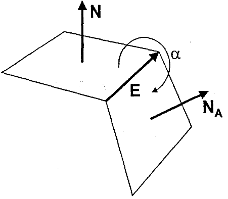
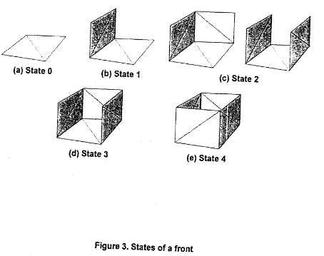
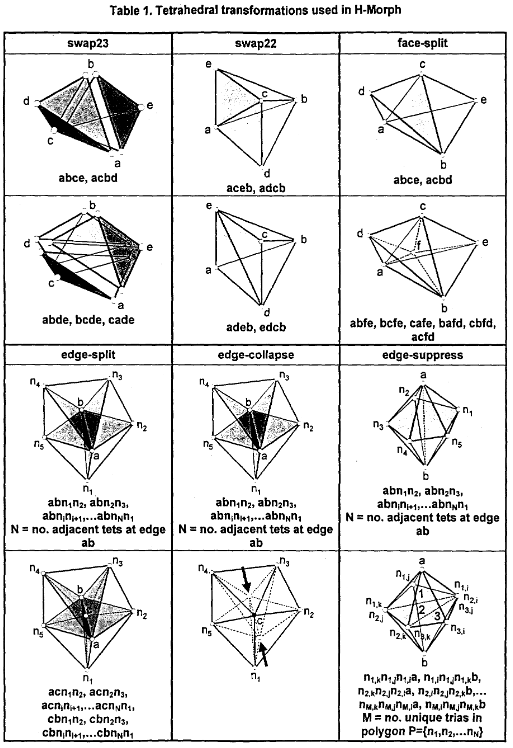
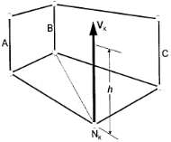
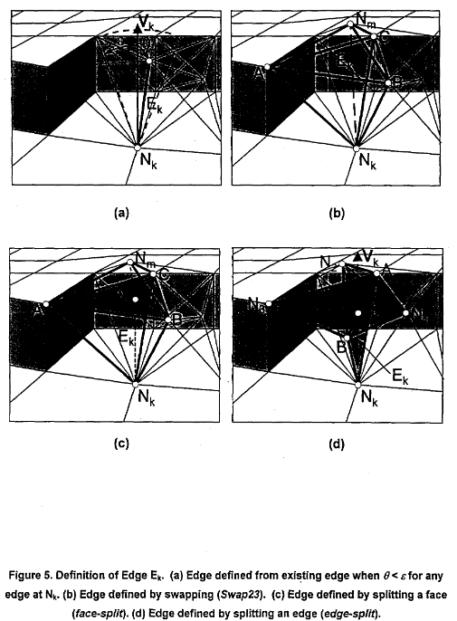

# H-Morph: an indirect approach to advancing front hex meshing

H-Morph是一种间接方法，

## 流程
- **表面四边形网格化**：输入表面四边形网格
- **四边形网格三角形化**：在保留原始四边形网格的前提下，划分quad为2个triangle，得到三角化的表面网格
- **初始化四面体**：根据输入边界的三角网格，对整个mesh进行四面体化。
- **定义前沿（Front）**：对当前网格元素的“状态（`State`）”进行编码。所谓“状态”，描述的是当前每个单一`Front`距离形成完整六面体的进度，是基于`Front`内Edge和相邻`Front`之间的角度
- **构建Front**：每个`Front`是逐个处理的，包含以下步骤:
  - **Seams** : 当相邻的两个`Front`之间的角度小于某个值 $\sigma$ 时，做Seam操作。
  - **拓扑检查（Topology Check）**：如果构建当前`Front`时，会导致周边`Front`无法构成hex时，停止处理当前`Front`。
  - **清理（Cleanup）**：如果当前`Front`之前被处理过且失败了，则在当前`Front`相邻的tet上执行局部优化操作；如果这个`Front`是某一层的第一个`Front`，那么剩余的tet都会被执行清理和平滑操作。
  - **构建面**：对于`Front`上的每条边，如果这条边没有一个邻居`Front`，且`Front`之间的夹角 $\alpha<3\pi/4$ ，则根据根据内部的tet生成一个quad。为了构造hex的每个quad，这个流程会重复执行，包含以下三步：
    - **边判定（Edge Determination）**：每个构成hex的quad的edge是根据当前`Front`划分的triangle生成的tet构造的。
    - **封闭条件（Closure Resolution）**：如果在当前Edge上检测到相对的`Front`时，执行封闭处理，以确保拓扑合法。
    - **恢复Edge和Face**：从两个tet中还原hex的Edges和Faces，每两个tet的triangle面用于恢复一个hex的quad面。
  - **顶层Face构造**：为了形成一个hex，hex顶层的Face也会通过上一步的方法构造。
  - **删除四面体和构造六面体**：删除所有的tet（`Front`内的，和quad上的），生成hex。
  - **局部平滑（Local Smooth）**：对新生成的hex的节点位置及节点的邻居节点进行微调，从而使新生成的hex形状质量更好，
  - **Front重分类（Front Reclassification）**：当所有`Front`被处理后结束，或者会剩余一些因为局部拓扑问题导致无法构造hex的`Front`。
- **平滑 （Smoothing）**：当所有的`Front`被处理过完后，会对所有内部节点进行平滑。
- **构造金字塔（Pyramid Fromation）**：如果还残留了一些tet，那么会构造金字塔元素用于连接tet元素和hex元素。

    
## Tet Mesh 生成
根据三角形片元生成tet[George et al. 1998](https://books.google.co.jp/books/about/Delaunay_Triangulation_and_Meshing.html?id=HZGfI61PSUQC&redir_esc=y)，也可以用一些其他的方法： [Marcum et al.1995](https://arc.aiaa.org/doi/abs/10.2514/3.12701)、[Lo et al.1991](https://www.sciencedirect.com/science/article/abs/pii/004579499190059U)

## 构造初始Front
一个`Front`被定义为包含了两个triangle的quad。这样，一个`Front`会与两个内部Tet相关联。

## Front State

`State`定义了每个`Front`当前距离构造一个完整hex的进度。它通过计算当前`Front`与相邻`Front`的公共edge的个数，这些相邻`Front`需要满足夹角 $\alpha<\frac{3\pi}{4}$ 。其中 $\alpha$ 通过如下计算：

$$
\alpha=
\begin{cases}
    \cos^{-1}(-\mathbf{N} \cdot \mathbf{N}_{\mathrm{A}})  &\text{for} \quad \mathbf{E}\cdot \mathbf{N} \times \mathbf{N}_{\mathrm{A}} <0\\ 
    2\pi-\cos^{-1}(-\mathbf{N} \cdot \mathbf{N}_{\mathrm{A}}) &\text{otherwise}
\end{cases}
$$

-  $\mathbf{E}$ 是两个`Front`的公共边，在当前`Front`上为逆时针
-  $\mathbf{N}$ 是当前`Front`指向(mesh)内部的法向量
-  $\mathbf{N}_{\mathrm{A}}$ 是相邻`Front`指向(mesh)内部的法向量
-  $\mathbf{N}$ 通过`Front`上的两个三角片元的法向量的平均值计算而来

> `Front`的状态(状态i表示当前`Front`有i个满足 $\alpha<\frac{3\pi}{4}$ 的相邻`Front`存在)
用一个int来存储状态，int的前4位，每位用来表示对应的边是否有满足 $\alpha<\frac{3\pi}{4}$ 的相邻`Front`存在。这些位也可以决定`Front`后续处理的目标及顺序。

## Front 的优先级
`Front`是按照优先级（Priority）逐个处理的。  
`Proto-hex`：一个用来跟踪当前`Front`正在构建的六面体的状态结构，保存了构造Hex时将会使用到的所有节点、边、和面的引用。
根据以下准则来定义优先级：
- Level：即当前`Front`所处的层（Layer）。由外至内，顺序处理。
- State：优先处理`State`高的`Front`，因为这些`Front`只差几个面就可以生成hex了。 而且，这种情况下，每处理一个`Front`，该`Front`的相邻`Front`的`State`也会提升，这种策略可以保证有序的生成六面体。
- Size：检查`Proto-hex`上具有最大面积的quad，优先选择面积最大的`Front`作为第一个。这样在构造Hex edge时，减少已有Edge的投影距离（新edge是通过已有edge投影得到的），提高构造hex的成功率。

## Tetrahedral Transformations

在构造过程种，要对tet做许多变换。任何操作都需要检查结果tet的体积为正。此外，有些局部顶点的位置重新分配操作，通常是分配在新位置和旧位置之间的一个位置上，要避免tet发生翻转，确保体积为正。

## Formation of Quadrilateral Side Faces
构造hex的quad侧面。如果`Front`的某条edge没有满足 $\alpha<\frac{3\pi}{4}$ 的`Front`，那么使用内部的tet来构造一个quad。

### Edge Determination
  
在base`Front`上构造它的quad侧面时，需要从base`Front`上投影一个edge来构造quad。这个过程中，需要检测投影出来的edge。假定base`Front`上有一节点 $N_k$ ， $E_k$ 定义为其从base`Front`投影（Project）出来的用于构造quad的边。需要给定一个投影的方向 $V_k$ 和投影的长度 $h$ :
- $V_k$ 首先定义为base`Front`的法线和 $N_k$ 所关联的`Front`的法线的平均值。在这个过程中，相邻的`Front`，如果其与base`Front`的夹角 $\alpha > 5\pi/4$ ，那么不会用于计算平均值。
-  $h$ 有两种取值。当base`Front`的`State`非0时， $h$ 的值等于`Proto-hex`中，与 $E_k$ 处于相同拓扑方向的edge的平均值（如上图，h等于边A、B、C的平均长度）。当base`Front`的`State`等于0时， $h=\sqrt{A_{bf}}$ ，其中 $A_{bf}$ 是 base`Front` 的面积。

如上图所示，定义夹角 $\theta_i=\cos^-1(V_k \cdot \vec{E}_i)$ ，表示与节点 $N_k$ 相关的所有edge $E_i$ ，其与 $V_k$ 的夹角。取最小的 $\theta_i$ 对应的 $E_i$ 为 $E_k$ 。注意， $E_k$ 必须满足 $\theta<\epsilon$ ，这里， $\epsilon$ 是一个经验值，其值为 $\pi/6$ 。

虽然 $E_k$ 满足 $\epsilon$ 误差，但是往往其长度会大于 $1.5h$ 。有两种方案处理这种情况：
- 由 $E_k$ 构成的新节点 $N_m$ ，需要使用节点重定位（node-relocation）将其分配到新的位置上，以确保 $E_k$ 的长度接近或等于 $h$ 。
- 当无法使用node-relocation时，那就在 $E_k$ 长度为h的位置上插入一个新节点。这个时候要执行一次`边分裂（edge-split）`操作。
由于在三角化的时候节点数越少越好，所以一般首先执行第一个操作，如果 $N_m$ 在 $Front$ 的对面（？）（Opposite）了，且 $E_k$ 的长度大于 $1.5h$ 了，才会插入一个新节点。

如果没有 $E_i$ 满足 $\theta_i<\epsilon$ ，则需要遍历所有与 $N_k$ 邻接的tet，找到 $V_k$ 穿过的tet $T_k$ 或face $F_k$ 。可以通过计算 $V_k$ 与这个tet内，与 $N_k$ 相邻的3个face $F_i$ 的法向量（指向tet内部的）的点积 $d_i$ 来判断：
1. 找tet：如果对于某个tet $T_i$ ，计算得到其所有 $d_i<0$ （注意，这里的 $V_k$ 是从外面指向内部的），那么说明 $V_k$ 完全在 $T_i$ 里面，则 $T_k=T_i$ 。
2. 找face：如果存在 $d_i=0$ ，则 $V_k$ 就在face $F_i$ 上，则 $F_k=F_i$ 。  

对于第一种情况，上图中的例(b)和例(c)展示了2种处理方案。有两个tet $ABCN_k$ 和 $ABCN_m$ 相邻，共面ABC，首先会判断边 $N_kN_m$ 是否满足 $\theta<\epsilon$ 这一条件：
- 如果满足，且使用`swap23`操作，将上下两个tet $ABCN_k$ 和 $ABCN_m$ 转换为 3个tet，以构造一条满足 $\theta<\epsilon$ 的边 $N_kN_m$ 。首先会判断边是否满足这个条件，且结果tet不会翻转。
- 如果不满足条件，或者变换结果会产生翻转的tet，那么会执行上图例(c)的结果，在 $V_k$ 与面ABC相交的位置插入一个新的节点 $N_n$ ， 执行`face-split`操作，将原来的2个tet分裂成6个tet。

对于第二种情况，上图的例(d)展示了处理方案：
- $V_k$ 位于三角面 $ABN_k$ 上，那么使用`edge-split`，在边 $AB$ 上插入一个新节点 $N_n$ 。每个与edge $AB$ 相关的tet都会被分开，从而 $N_kN_n$ 构造为了新的edge $E_k$ 。

## 局部hex闭合（Closure Resolution）
在前沿推进的时候，要么 $E_k$ 会成为现有`Front`的一部分，或者 $E_k$ 的相反节点 $N_m$ （沿着节点 $N_m$ 对称的）会位于现有`Front`上。

如果选择的是 $E_k$ ，那么会构成一个封闭条件，所以很有必要判断结果拓扑是否有可能构成一个hex。虽然Q-Morph算法中通过“奇偶规则”来处理闭合的方法很有效，但是为了确保cell质量，H-Morph可能需要更加启发式的思想。

首先遍历节点 $N_k$ 的所有邻接边 $E_i$ ，这些边分为以下3类：
1.  $E_i$ 是现有`Front`的一条边
2.  $N_m$ 位于已有`Front`上， $E_i$ 没有。
3.  $E_i$ 和 $N_m$ 都不位于已有的`Front`上

为了封闭局部的hex，需要对这些边排序，优先选择能够提供最佳封闭条件的边，而不是那些会导致产生新`Front`的边。

首先筛选出 $\theta_i<\epsilon$ 的边。对于第一类边，最高优先级，然后依次是第二类和第三类。对于第三类，用上面说的`swap23`、`face-split`、`edge-split`等方案处理。

为了进一步选择有利于封闭的边，对于第一类和第二类，使用另外一个版本的 $\epsilon$ ，值基于当前`Front`的层（`Level`） $l_c$ ，

$$
\epsilon
=
\begin{cases}
&\epsilon_b+(\epsilon_i-\epsilon_b)\frac{l_c}{4} &\quad \text{for} &l_c \leq 4 \\
&\epsilon_b &\quad \text{for} &l_c>4
\end{cases}
$$

其中 $\epsilon_b=\frac{\pi}{6}$ 、 $\epsilon_i=\frac{\pi}{3}$ ，这是两个经验值。这是一个对 $\theta_i<\epsilon$ 条件的松弛，专门用于处理那些远离边界的边，从而可以提高cell的质量。

而对于前两类边，则使用一个度量 $\beta$ 排序，$\beta$ 被定义为 $E_i$ 可能构造的所有quad中的最差质量：

$$
\begin{cases}
\beta=\min(\alpha_1,\alpha_2,\alpha_3,\alpha_4) \cdot \min(v_1,v_2) \\
\alpha_i=4\sqrt{3} \frac{A_i}{l_{i,1}+l_{i,2}+l_{i,3}}
\end{cases}
$$

-  $\alpha_i$ 是quad上4个顶点组成的triangle的一个度量
-  $A_i$ 是triangle的面积
-  $l_{i,j}$ 是第 $i$ 个triangle上第 $j$ 条边的长度
-  $v_1=N_1 \cdot N_3$ ， $v_2=N_2 \cdot N_4$ ，分别是两个相对三角形的法向量点积

在`State`=0的时候，因为还没有可能产生的quad，所以 $\beta$ 的值为最大值1.0。

为了考虑quad的变形，需要计算每个triangle的法向量 $N_i$ ，使用每对三角形的最小点积来减少 $\beta$ 

> 存疑？？比方说对于一个平面quad， $\min(v_1,v_2)=1.0$ 。而对于两个triangle，如果他们不在一个平面上，更极端点，相互垂直，在这种情况下，$\min(v_1,v_2)=0$

当可能构成quad的顶点位置确定后，可以得到初始的 $\beta$ 。此时，需要根据所选的 $E_i$ 的类别，从 $\beta$ 中减去一个修正量（modifier） $\chi$ ，即 $\beta - \chi$ , $\chi$ 。
- 当 $E_i$ 属于第1类时，如果这个face无法构造合法的hex， $\chi=0$ ，否则 $\chi=1.0$
- 当 $E_i$ 属于第2类时，首先执行局部`Front`的遍历，判断 $E_i$ 是否会构造合法的封闭（从节点 $N_k$ 开始，通过给每个局部`Front`分配一个整数 $ \lambda$ 判断）
  1. 如果`Front` face的处于同一个拓扑平面，那么这个`Front` $\lambda=0$ 
  2. 与 $\lambda=0$ 的`Front`相邻的`Front`，且它们之间的公共边的角度小于 $\frac{3\pi}{4}$ 的`Front`的 $\lambda=1$
  3. 遍历 $\lambda=1$ 的`Front`，对于它未被分配 $\lambda$ 的邻接`Front`，如果它们之间的公共边的角度小于 $\frac{3\pi}{4}$ ， 分配该`Front` $\lambda=2$  
- 此时，判断`Front`的邻接节点 $N_m$ ，对于 $N_m$ 的所有满足 $\lambda<2$ 的邻接face，$\chi=1.0$ ，满足 $\lambda \geq 2$ ， $\chi=0.0$ 

对于第1类和第2类封闭edge，当可供选择的 $E_i$ 多余1个时，选 $\beta$ 最大的 $E_i$ 。同时，第1类edge永远优先与第2类edge。此外，当 $E_i$ 的 $\beta$ 低于阈值 $\beta_1$ 时，直接舍弃。 $\beta_1$ 通过当前`Front`的`level` $l_c$ 计算得到：

$$
\beta_1
=
\begin{cases}
\beta_b+(\beta_1-\beta_b)\frac{l_c}{4} &\text{for} &l_c \leq 4 \\
\beta_i &\text{for} &l_c > 4
\end{cases}
$$

-  $\beta_b$ 是边界上允许的最小 $\beta$
-  $\beta_i$ 是内部上允许的最小 $\beta$
- 基于[这篇文章](https://www.proquest.com/openview/6a24746a4cfb33148c561f49b8bba715/1?pq-origsite=gscholar&cbl=18750&diss=y)，这两个取值分别为 $\beta_b=0.25$ ， $\beta_i=-0.5$

## Face和Edge的恢复
这是H-Morph的一个关键步骤，主要用于确定每个hex的edge和face。
每个hex的face必须恢复两个triangle face

- 边恢复（`edge-recovery`）：通常用`swap23`和`swap22`操作来进行边恢复
- 面恢复（`face-recovery`）：主要用于消除穿透（penetrating）面和边，恢复三条现有边之间的triangle face的步骤，主要用`edge-suppress`操作来处理

>具体实现参考[论文1](https://www.proquest.com/openview/6a24746a4cfb33148c561f49b8bba715/1?pq-origsite=gscholar&cbl=18750&diss=y)和[论文2](https://www.researchgate.net/profile/Steven-Owen-2/publication/2310238_Constrained_Triangulation_Application_To_Hex-Dominant_Mesh_Generation/links/00b49525190cacd522000000/Constrained-Triangulation-Application-To-Hex-Dominant-Mesh-Generation.pdf)

## 构造quad顶面
当hex的四个侧边（`sides`）构造完成后，最后需要构造hex的顶面（`top`）。有的时候是不需要构造的，因为对面推进过来的`Front`会构造当前hex的顶面。大部分时候，用上一部分一样的方法恢复边界

## 删除tet和构造hex
目的是消除已经构造完的`proto-hex`中残留的tet。
- 取与base`Front`的一个相邻tet
- 循环遍历base`Front`的所有邻居tet，记录处理过的tet
- 直到碰到`proto-hex`的quad face（quadrilateral faces），停止遍历
通过这种方式，可以得到`proto-hex`中的所有tet，从而可以删除所有
- 首先遍历base`Front`的所有邻居tet，在list中保存所有处理过的tet，直到碰到`proto-hex`的quad face

