# Locally Meshable Frame Fields
# 简介
在基于标架场的六面体网格生成算法中，对鲁棒性影响最大的问题就是不可网格化的拓扑参数（`non-meshable topological configurations`）。它们在对标架场进行平滑时会产生，但是却无法构造整数网格映射（`integer-grid map`）
1. 提出了关于局部可网格化标架场（`locally meshable frame fields`）的理论
2. 提出了一个算法，用于将给定标架场转换为`meshable`的标架场

不足：
1. 需要对zipper nodes进行严格的限制
2. 局部可网格化只是全局可网格化的必要非充分条件。  
3. 给定一个可网格化的标架场，目前没有算法可以保证能够找到一个具有唯一拓扑结构的无缝映射。

# 背景
首先回顾一下典型的整数网格映射流程：
1. 特征对齐的标架场
2. 无缝参数化
3. 整数化
4. 整数网格映射
5. 六面体化网格

目前，步骤2、4可以分别通过[Bruckler et al. 2022](https://dl.acm.org/doi/abs/10.1145/3528223.3530123)的整数化算法和[Lyon et al. 2016](https://dl.acm.org/doi/abs/10.1145/2897824.2925976)的线性网格提取算法鲁棒的完成，其余步骤仍然不稳定。

# 标架场的可网格性（Meshability）
鲁棒性差最主要的来源是标架场和整数网格之间的拓扑错位（`topological mismatch`），

# 2d网格的meshablity
## 2d向量场的拓扑
### 局部向量场拓扑
对于一个向量场， $v(\boldsymbol{x}):\Omega\rightarrow \mathbb{R}^2$ ，如果某处（点、线、面）的 $||v(\boldsymbol{x})||_2=0$ ，那么该处被称为`singularities`（奇异点）。在奇异点的局部邻域中，`streamline`（流线）根据其向前和向后流动方向，可以有四种分类：

- `closed orbit`：环绕奇点形成封闭路径。
- `parabolic`（抛物线）：往一个方向收敛和往另外一个方向发散。如果前进的方向是收敛的叫做`inflow`，否则叫`outflow`。
- `hyperbolic`（双曲线）：在两个方向上都发散。
- `elliptic`（椭圆线）：在两个方向上都收敛。

通过对局部邻域 $D_\epsilon$ 的边界环 $\partial{D_\epsilon}=C_\epsilon$ 上穿过的所有`streamline`的类型和顺序可以确定奇异点的类型。

- 如图（a）所示：某个奇异点邻域的向量场拓扑。由绿色的抛物线（parabolic）、蓝色的双曲线（hyperbolic）、红色的椭圆线（elliptic）形式的`streamline`组成领域下的了5个部分。
- （b）全局的向量场拓扑，整体的拓扑结构由所有的黄色分离线（separatrices）组成，将空间分割成具有相同流动动行为的区域，可能存在封闭环（`closed orbit`）。其中，绿色的极限环（`limit cycle`）是收敛至封闭环的`streamline`

`separatirx`（分割线）是由`elliptic`和`parabolic`在划分空间时产生的。
> 一个观察：`elliptic`和`parabolic`因为都经过了`singularity`，所以能够产生分割线，而`hyperbolic`不会经过`singularity`，所以它只能逼近分割线。

一个内部奇异点的的`index`量化了：沿着 $C_\epsilon$ 逆时针遍历时，向量场旋转了多少周：

$$
I=1-\frac{1}{2}n_h+\frac{1}{2}n_e
$$

-  $n_h$ 、 $n_e$ 分别是关于`hyperbolic`和`elliptic`的`streamline`数量。
-  $n$ 前面的符号表示是逆时针还是顺时针。
-  $n_h$ 、 $n_e$ 总是偶数，从而 $I$ 永远是整数。

### 全局向量场拓扑
局部拓扑骨架（`topological skeleton`）通过将域划分为有相同流动模式（identical asymptotic flow behavior.）的子域，编码向量场的全局拓扑。在全局尺度上，还有一种额外的`streamline`类型，被称作`limit cycle`，它渐渐收敛为一个`closed orbit`。如下图绿色曲线所示：  

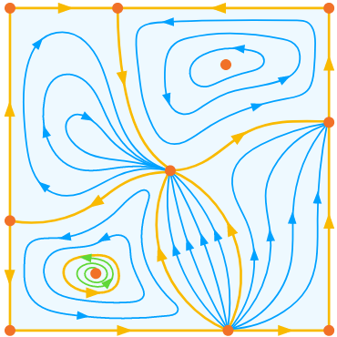

### 局部标架场拓扑
二维标架由3个 $\mathbb{R}^2$ 构成。它们每对都是不平行的，通常定义为一个矩阵 $F$ ：

$$
\{u,v,-u,-v\}， F=[u,v]\in{\mathbb{R}^{2\times 2}}
$$

- 对于非奇异点： $||F||_2\ne0$ ，要求 $\det{F}>0$ 可以使得u方向的`streamline`（`u-streamlines`）永远不会与v方向的`streamline`（`v-streamlines`）平行，并且标架向量还不会消失。即：确保标架不会退化。

用**代数拓扑**的语言描述，一个标架场对应一个4层分歧覆叠空间（4-sheeted branched cover）。每个分歧点对应了 $\{u,v,-u,-v\}$ 中的一项。但是，使用CCW顺序遍历分割线时，每个分割线可能属于不同的分歧层（即可能是u或者v或者-u或者-v的分割线）。
举个例子：一个`outflow`的u分割线的后续肯能是一个`outflow`的v分割线。但是，两个**CCW**连续的分割线，只可能是下面这几种情况：
1. 两个连续的分割线处于同一个分歧（`branch`）
2. 是下一个分歧（`branch`）(以 $\{u,v,-u,-v\}$ 为例， $v$ 下一个只能是 $-u$ )
3. 是上一个分歧（`branch`）(以 $\{u,v,-u,-v\}$ 为例， $v$ 上一个只能是 $u$ )
> 即：分割线的相邻性可以用 $\{u,v,-u,-v\}$ 的相邻性表达

例子：一个`outflow`的u分割线（即对应 $\{u,v,-u,-v\}$ 中的 $u$ ）的后续只能是
1. 同样的`outflow`的u分割线，
2. 是`outflow`的v分割线（即对应 $\{u,v,-u,-v\}$ 中的 $v$ ）
3. 是`inflow`的v分割线（即对应 $\{u,v,-u,-v\}$ 中的 $-v$ ）

在这三种分类下，可以把空间的部分划分为三类：`polar`、`quad`、`anti-quad`：
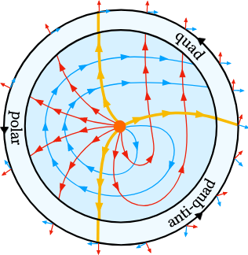
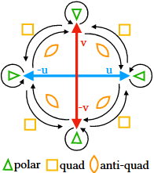

- 左图中，从最右边那条黄色分割线开始（这条线是`outflow`的u分割线，对应 $u$ ），以CCW顺序遍历其余的黄色分割线。右图则是不同类别分割线所划分的区域的类型。
- 它的下一条分割线是`outflow`的v分割线，对应 $v$ ，所以他们之间的区域，如右图所示，是从 $u$ 指向 $v$ ，对应`quad`区域。
- `outflow`的v分割线的下一条分割线仍然是`outflow`的v分割线，所以它们之间的区域，是从 $v$ 指向 $v$ ，对应`polar`区域。
- 最后，从`outflow`的v分割线回到了`outflow`的u分割线。所以它们之间的区域，是从 $v$ 指向 $u$ ，对应`anti-quad`区域。

从而，一个奇异点的`index`相应的可以用以下公式表示：
$$
I=1-\frac{1}{4}n_q+\frac{1}{4}n_a
$$

-  $n_q$ 、 $n_p$ 、 $n_a$ 分别表示`quad`、`polar`、`anti-quad`的数量

## 2d标架场的meshability
定义：`meshable`指的是，一个四边形网格存在一个唯一的拓扑。

在四边形网格上，四边形的边可以被理解成目标标架场`streamline`的离散表示。同样的，一个离散流线`discrete streamline`会穿过常规顶点，会形成封闭的环也可能在边界点或奇异点处停止。

### meshability condition
1. （C1）:特征对齐（`Feature Alignment`）:标架场与所有的特征曲线对齐，确保正确的构造四边形网格。
2. （C2）:孤立的奇异结构（`Isolated Singularities`）:所有满足 $||F||_2=0$ 的奇异结构都是奇异点，不存在可能导致网格退化的奇异线或者奇异面（curve or patch singularities）。
3. （C3）:只有四边形（`Quad sectors only`）：标架场不能由`polar`和`anti-quad`区域。这些区域会导致非四边形单元的产生。
4. （C4）:不存在极限环（`No limit cycles`）：网格诱导的标架场拓扑的所有`streamline`，要么是`closed orbits`，要么在奇点或者边界处终止。

### 区域修改以确保Local meshability
> 局部可网格化要求满足条件1、2、3。条件4可以略去，只有在全局尺度上考虑时有关 。

当给定一个标架场只满足条件1、2时，通过修改其奇点的 $\epsilon$ 邻域 $\mathcal{N}$ ，是可以让他也满足条件3的：

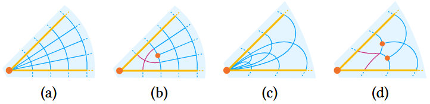

- 上图a->b。a是一个`polar`类型的区域，可以添加一个`index`满足 $I=\frac{1}{4}$ 的奇点，使得`polar`区域可以转换为`quad`区域。这种转换，不会影响到其他区域。
- 同样的，上图b-c。`anti-quad`区域可以转换为`quad`区域，只需要添加2个 $I=\frac{1}{4}$ 的奇点。

使用 $\Delta n_a$ 、 $\Delta n_q$ 来表示改变前后的变化量。
- 对于a->b。在原始奇点处，相当与新增了一个`quad`区域，而在在新增奇点处，实际上移除了一个`quad`区域，所以这记为 $\Delta n_a=\Delta n_q=0$
- 对于c->d。在原始奇点处，移除了一个`anti-quad`区域，新增了一个`quad`区域；在新增奇点处，都分别移除了一个`quad`区域。所，记为 $\Delta n_a=\Delta n_q=-1$
> 具体算法可以见 [Myles et al. 2014](https://d1wqtxts1xzle7.cloudfront.net/80303719/14fieldtrace-libre.pdf?1644127037=&response-content-disposition=inline%3B+filename%3DRobust_field_aligned_global_parametrizat.pdf&Expires=1763023467&Signature=CWcjoJiJr5xBCJaoba2vfdwNUH03SZmJhiC58Mgt9NkkxWhwNfVm7uPcqmbNczD4j555u92Uzc2ARksI378vKxwVhExqE3FkrjkigeyfIVw9ewVuyhUSy~eAgtJmbxoxwJylqcHG-s~llqBdQfuhM8Zhee96iEN303iIJAbkSAlsBwURBOER9Qjpp49Gm1-NSAIEwF~hEt2LPV20zZVZ77oJUhgQBvARYhL3QhG6CK~CjBRcphfzpvIaZ~U9A6nXixbu2a543VsaeM5aabcSSICt3BOhzPbPoYDvslgBOHs7VXRr-Vh84WMxxNeenZsBJvhUG6cUhNO3a~LrUvSBZQ__&Key-Pair-Id=APKAJLOHF5GGSLRBV4ZA)

最后，如果一个标架场是`local meshable`的，可以通过[Myles et al. 2014](https://arxiv.org/pdf/2112.05793)提出的基于`motorcycle graph`的算法使其`globally meshable`。

## 3d标架场的meshability
同样的，hex mesh也可以视为3d标架场的`streamline`的离散表示。其中的奇异结构主要包含`nodes`和`flow-aligned arcs`，可以用奇异图（`singularity graph`）表示。但是，不同与2d情况，它主要由2个情况：
1. `streamsurface`的不唯一性。
2. 奇异弧（`singular arcs`）的存在。

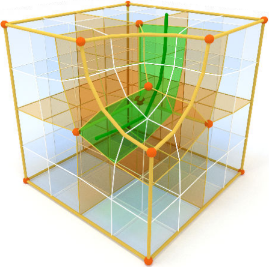

- 在三维场景中，一个hex网格引导的标架场，其`streamline`总是对齐所有hex网格的边、面，并且沿着（图中深绿色的）对偶弦（`dual chords`）流动（图中淡绿色部分）。橙色的是分界线（`separatrices`）和分界面（`separating surfaces`）。

### Streamsurface
`streamline`可以通过三维空间的向量场 $u(x):\mathbb{R}^3\rightarrow\mathbb{R}^3$  的积分唯一的确定。但是如果两个向量场 $u(x):\mathbb{R}^3\rightarrow\mathbb{R}^3$ 和 $v(x):\mathbb{R}^3\rightarrow\mathbb{R}^3$ 组合构造的`streamsurface`却并不能唯一的构造。以下图为例。

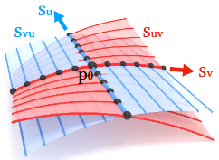

即`streamsurface`的形状由这一块区域的向量场决定。然而，一个重要的点：

只由当向量场是可积的时候，即满足Frobenius定理[Frankel et al. 2011](The Geometry of Physics: An Introduction)的充要条件时，`streamsurface`才能被明确定义！

> 即对于区域内的任意一处满足 $s_{uv}=s_{vu}$ 

所以，只有**保证了`streamsurface`的可积性**，才能明确的定义一个`well-defined`的`streamsurface`将空间划分为hex。

## 奇异弧（Singular Arcs）
一个2d标架场的局部邻域被称为`footprint`。沿着另一个轴，形成一个扫掠体（`sweep`）。那么中间会形成一条 `flow-aligned singular arc`，如果奇点周围都`quad`区域，那么这个扫掠体被叫做`meshable singular arc`。`flow-aligned singular arc`的`index`就是其`footprint`的`index`。

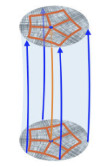

六面体网格诱导的标架场仅包含`meshable singular arcs`，但是一般的标架场允许`non meshable singular`类型，可能会存在以下缺陷：
1. （D1）:复合单值路径（`Compound Monodromy`）：标架场沿着某个轴防线给旋转的叫做`flow-aligned arcs`，八面体群中的其他不可网格化单值是有可能存在的。
2. （D2）:流错配（`Flow Misalignment`）：奇异弧与标架场不是相切的，见下图
3. （D3）:非常数邻域（`Non-constant Footprint`）：虽然流对齐弧的`index`是常数，但是`sector`任然可以沿着弧变化并同时保持`index`不变。比方说：一条孤立的分界线可以变成一个`polar`区域或者变成一对`hyperbolic`区域或者变成一对`elliptic`区域（因为这样分裂并不会改变`index`）。
4. （D4）:不可网格化邻域（`Non-meshable Footprint`）：有些网格不满足条件3（只能有4边形）

奇异弧的单值性（`monodromy`） $\mu$ ，描述了沿着环绕奇异弧的环（不包括其他奇点）移动时，参考系所经历的旋转。它是八面体群（`octahedral group`） $\mathcal{O}$ 中的一个元素。24种八面体群元素中，只有10种是围绕着标架的一个轴旋转的，并且可以生成`meshable`的奇异弧。其余14种是复合类型（`compound type`），其无法生成`meshable`的奇异弧，且 $\text{rank}(F)=1$。

### Arc Zipping
对奇异弧和奇异节点进行调整的一个基本操作是`zipping`和`unzipping`：
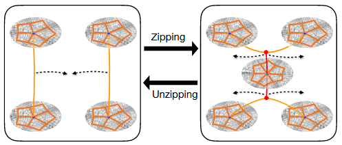
- `zipping`：有两条平行的`flow-aligned singular arc` $A_1$ $A_2$，其`index`分别为 $I_1$ 和 $I_2$ 。把它们合并成为一条新的`flow-aligned singular arc` $A_z$ 。这个操作叫做`zipping`。且，结果奇异弧的`index`为 $I_z=I_1+I_2$ 。
-`zipper nodes`：在`zipping`和`unzipping`前后，都会产生一个奇异节点，称为`zipper nodes`。

`arc zipping`操作其实是2d上插入节点修改区域类型的的一种推广。比方说：
- 一条常规`streamline`，即 $I=0$ 的`flow-aligned singular arc`，可以被`unzipped`为拥有相反`index` $I_1=-I_2$ 的两条奇异弧。这个特性可以用于所有其他`meshable`的构造过程中，因为这两条奇异弧的生成分别对应`footprint`中一个`quad`扇区的新增和删除。

通过依次移除上面提到的4种缺陷，一个标架场可以变成仅具有`meshable`奇异弧的标架场。
1. 缺陷1：jiang et al 2014 指出，所有`non-meshable`的单值环是`meshable`单值环的乘积。即：所有`non-meshable`的奇异弧是两条已经被合并（`zipped together`）在一起的非平行弧。即：一个复合类型的奇异弧，总是可以被非平行的`unzipping`分解为两条非复合类型的奇异弧。
2. 缺陷2：可以通过对局部邻域 $\epsilon$ 上的标架场进行一个连续变换，从而使得这些标架场在保持光滑的前提下与奇异弧相切
   - 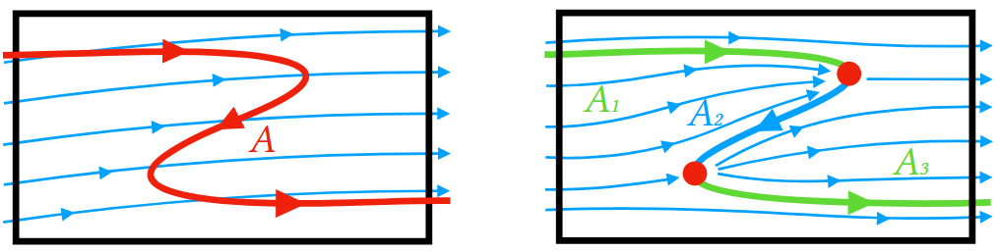
   - 上图中：红色的奇异弧A具有常量单值性 $\mu_A$ ，且与u方向的流线并不对齐。通过对A进行旋转，使得A能够同时对齐 $\pm u$  ，原来的奇异弧被新增的奇异点划分为3部分： $A_1、A_2、A_3$ ， 其中，绿色的 $A_1、A_3$ 与 $u$ 的正方向对齐， $A_2$ 与 $u$ 的负方向对齐。 $A_1、A_3$ 的`index`为 $I$ ，而 $A_2$ 的`index`为 $-I$
   - 有向弧 $A$ 有两个对齐选项： $\pm a_\mu, a_\mu \in \{u,v,w\}$ ，对应单值性变换下的保持不变的两个标架轴。
3. 缺陷3：可以通过在过渡点处添加奇异点，将一个奇异弧分裂为具有固定`footprint`的多个子弧（`sub-arcs`），
4. 缺陷4：可以使用`unzipping`修复。

## 奇异点
在六面体诱导的标架场中，所有的奇异点是由多个奇异弧汇聚而成的分支点，且满足 $||F||_2=0$ 。

- **定理1**：所有`meshable`的奇异点都可以通过对`index`为 $\pm\frac{1}{4}$ 的`meshable`的奇异弧使用迭代的`unzipping`操作构造。
- **定理2**：一个标架场中，每个仅与于`index`为 $\pm \frac{1}{4}$ 的`meshable`奇异弧相交的奇异点，都可以通过仅修改局部邻域，分解为有限个孤立`meshable`奇异弧集合和有限个孤立`zipper nodes`集合。
- **定理3**：通过修改一个任意小的局部邻域，所有与`meshable`的奇异弧相交的奇异点，不管它与什么特征曲线和特征曲面相连，都可以被修改为`meshable`的奇异点，该节点连接着一组向外的`zipper`节点、若干组额外的孤立的`meshable`奇异弧、孤立的`zipper`节点。

并不是所有的奇异点都是通过对`meshable`的奇异弧进行操作而得到的。

## 处理特征约束
对于表面的特征约束，**定理2**并不能确保能够对奇异点进行分解。因为在进行修改时，特征对齐约束可能会导致产生新的不渴望个话区域。

1. 逐步处理素有与奇异点相连的`non-meshable`（即`parabolic`）扇区
2. 新增加的`parabolic`扇区不与奇异点相连，是一个拉链节点，其`unzipping`方向与原始奇异节点相反
3. 所有的奇异弧保持`meshable`
4. 有限考虑可以减少奇异弧数量的修改方案。

对应的，有以下操作：
1. T1，奇异弧分离（Detachment）

# 离散局部可网格性

### 标架场表示
一个标架场是由 $SO(3)$ 中的元素，结合值域为八面体群 $\mathcal{O}\sub SO(3)$ 的匹配变换（`matching transformation`） $M$ ：
$$
F_i=[u_i,v_i,w_i] \in \mathbb{R}^{3\times 3}, \quad \det{F_i}=1
$$

从而，一个标架 $F_i$ 可以通过相邻元素变换得到：
$$
\eta_{i\to j}(F_i)=F_iM_{ij}, \quad M_{ij}=M_{ji}^{-1}
$$

### 边的单值环（Monodromy）

$$
\mu_{ij}=M_{i_0i_1}M_{i_1i_2}\cdots M_{i_ki_0}
$$
- Monodromy指的是对于tet的边 $e_{ij}$ 对应的对偶环 $D_{ij}$ ，在其上逆时针环绕一圈，访问过的tet单元 $c_{i0},c_{i1},\cdots,c_{ik}$ 。这个访问顺序对应一个沿着对偶环的组合变换`transformation`。

### 流对齐Index和扇区类型
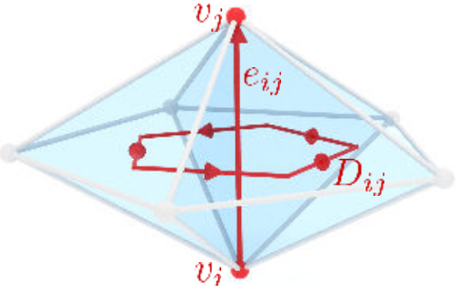

$$
I_{ij}=\frac{1}{2\pi}\sum_{e_{kl}^\star \in D_{ij}} \alpha_{ij}(F_k M_{kl},F_l)
$$

-  $\alpha_{ij}(F,G)$ 表示带符号的旋转角度。以 $e_{ij}$ 为旋转轴，度量从标架 $F$ 到标架 $G$ 发生的旋转。
-  $I_{ij}=I_{ji}$
-  $D_{ij}$ 表示 $e_{ij}$ 的对偶环（`dual cycle`）
-  

$$
\gamma_D=\sum_{c_{ijkl}\in D}\beta_{ij}^{kl}-\sum_{e_{kl}^\star\in D}\alpha_{ij}(F_k M_{kl},F_l)
$$

-  $\beta_{ij}^{kl}$ 表示与 $e_{ij}$ 相连的tet $(i,j,k,l)$ 构成的二面角（`dihedral angle`）
- `quad`扇区， $\gamma_D=\frac{1}{2}\pi$ ，`polar`扇区， $\gamma_D=0$ ，`anti-quad`扇区， $\gamma_D=-\frac{1}{2}\pi$ 。

## 标架场优化
将标架场用单位四元数表示：
$$
f_i,M_i\in \mathbb{R}^4
$$

2个旋转的平均，可以用2个单位四元数 $q_0,q_1$ 表示：
$$
q_s=q_0+sgn(q_0\cdot q_1)q_1
$$

## 离散网格修复

### 离散 Zipping
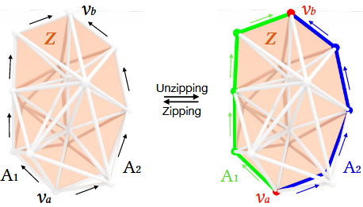
1. 记Tetmesh内部的一个由三角形面片的组成的拓扑圆盘为 $Z$
2. 将穿过 $Z$ 中三角形的所有对偶边的matching统一为 $M_z\in \mathcal{O}$
3. 选择 $\partial Z$上的两个顶点 $v_a,v_b$，将边界划分为两条从 $v_a$ 指向 $v_b$ 的弧 $A_1$ 和 $A_2$ 。将Monodromy的变化与标架场对 $A_1$ 和 $A_2$ 的对齐结合起来（即：选择与 $M_z$ 一致的标架轴），会将 $A_1$ 和 $A_2$ 的`index`分别变为 $I$ 和 $-I$
4. 同样的，使用 $M_z^{-1}$ 可以反向的恢复 `Zipping 操作`

## 处理奇异图上的噪声

### 奇异结构重定位

$$
\text{s.t.}
\begin{cases}
x_i-p_i&=0, \quad \forall v_i\in V_F \\
(x_i-p_i)\times t_i&=0, \quad \forall e_{ij}\in E_F \\
(x_i-p_i)\cdot n_i &=0, \quad \forall t_{ijk} \in T_F
\end{cases}
$$

构造了一个最优化问题
$$
\begin{align*}
\min_{x}& \quad E_a+E_s+E_c+E_d+E_r \\
\text{s.t}&\quad x_i-p_i=0, \forall v_i\in V_F \\
&(x_i-p_i)\times t_i=0, \forall e_{ij}\in E_F \\
&(x_i-p_i)\cdot n_i =0, \forall t_{ijk} \in T_F
\end{align*}
$$
-  $x_i,p_i \in \mathbb{R}^3$ 分别代表奇异点 $v_i$ 的新坐标和当前坐标。
-  $t_i \in \mathbb{R}^{3}$ 是与 $v_i$ 相连的特征切线的向量， $n_i$ 是相连的特征表面的法向量。

**对齐（alignment）能量** $E_a$
用于把奇异弧 $e_{ij}\in E_S$ 与相连的tet的平均标架场方向 $d_{ij}$ 对齐

$$
E_a=\frac{w_a}{s}\sum_{e_{ij}\in E_M}\frac{|(x_i-x_j)\times d_{ij}|^2}{l_{e_{ij}}}
$$

-  $l_{e_{ij}}$ 是边长， $E_M\sub E_S$ 是奇异边中具有`meshable`单值性的子集

**收缩（shrink）能量** $E_s$
用于收缩具有`non-meshable` `monodromy`的奇异边，或者同时收缩与拉链节点相连的边

$$
E_s=\frac{w_s}{s} \quad \sum_{e_{ij},e_{jk}\in E_C \cup E_Z} \frac{|x_i-x_j|^2}{l_{e_{ij}}}
$$

**曲率（curvature）能量** $E_c$
用于平滑，通过最小化具有`meshable` `monodromy`的奇异弧的曲率，

$$
E_c=\frac{w_s}{s} \quad \sum_{e_{ij},e_{jk}\in E_M}\frac{|x_i+x_k-2x_j|^2}{l_{e_{ij}}+l_{e_{jk}}}
$$

**变形（deformation）能量** $E_d$
用于防止tet退化或者翻转，同时防止表面法线发生翻转
$$
E_d=w_d\sum_{v_i\in V_S}\sum_{c_{ijkl}\in C} \log \frac{tr(J_t^TJ_t)}{det(J_t)^{\frac{2}{3}}}
$$

-  $J_t$ 是将tet变为规范型tet过程中的jacobi矩阵
- 为了防止表面法线翻转，对于每一个边界顶点 $v_i$ ，将其所有相连的边界三角形，沿着其法线方向挤出（高度为局部平均边长）一个虚拟的tet（virtual tet），从而添加一组虚拟tet

**排斥（repulsion）能量** $E_r$
用于防止拉链节点修复，导致的奇异弧相互之间过于靠近。作用与所有新创建的弧 $V_R$ 上的顶点。

$$
E_r=\frac{w_r}{s} \sum_{v_i\in V_R} E_{r_i}
$$

$$
E_{r_i}=
\begin{cases}
\frac{1}{2d_i}|x_i-\hat{p}_i|^2 \quad &\text{if} \,\, d_i \le l_{min} \\
0 & \text{otherwise}
\end{cases}
$$

- 其中， $\hat{p}_i=\frac{p_i+p_i'}{2}+l_{min}\frac{p_i-p_i'}{|p_i-p_i'|}$ ，是排斥的目标点，根据距离 $v_i$ 最近的另一条奇异弧上的顶点 $p_i'$ 计算得到
-  $d_i$ 表示与 $p_i'$ 的距离
-  $l_{min}$ 表示 $v_i$ 所在奇异弧上，奇异点的最小目标边长

默认的参数设置为：
$$
\begin{cases}
w_a=1\\
w_s=1\\
w_c=1\\
w_r=0.1\\
w_d=0.01\\
s=\sqrt[3]{|\mathcal{T}|}
\end{cases}
$$

# 整数网格映射构建
## 无缝映射
使用对称迪利克雷能量（symmetric dirichlet） $E_{SD}=\int_{\Omega}S_D(J)dV$
$$
S_D(J)=
\begin{cases}
||J||_2^2+||J^-1||_2^2 &\det J>0 \\
\infty &\det J \le 0
\end{cases}
$$

分片线性的可积性要求两个相邻tet $c_i,c_j$的梯度是相同的（在投影到公共三角面 $t_{ij}$ 时），从而可以得到一个线性约束：

$$
P_{ij}(J_I^T-M_{ij}^{-T}J_{j}^T)=\bar{0}
$$

到那时这个并不能保证可以得到全局单射，也不能保证 能够正确重现标架场的拓扑。从而，调整了能量的设置：

$$
\begin{cases}
E_S=\int_{\Omega}||\nabla J||_2^2dV
\end{cases}
$$

1. 增加了一个平滑设置 $E_S$
2. 确保优化器不会产生翻转状态

$$
E=E_{SD}+w_S E_S+W_I E_I
$$

